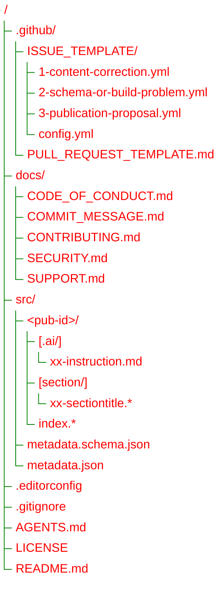

Publications Collection
===

This repository is a working archive for publications.

It stores:
- original authorial publications;
- adaptations of third-party publications, such as translations, annotated versions, or derivative works,
  when the original license permits this.

The repository is not intended to be a generic archive of third-party materials.
Every publication is stored as a separate unit under `src/<pub-id>`.

Repository Structure
---

Repository Structure: Tree View

### Contents Description

**.github/ISSUE_TEMPLATE/**
: GitHub issue forms for content corrections, schema or build problems, and publication proposals.

**.github/PULL_REQUEST_TEMPLATE.md**
: GitHub pull request checklist for proposed repository changes.

**AGENTS.md**
: General guidelines for AI agents and tools.

**.editorconfig**
: Style guides file.

**docs/CODE_OF_CONDUCT.md**
: Contributor conduct and moderation expectations.

**docs/COMMIT_MESSAGE.md**
: Commit message format and convention guidance.

**docs/CONTRIBUTING.md**
: Contribution scope, review expectations, and repository conventions.

**docs/SECURITY.md**
: Security reporting scope and vulnerability disclosure guidance.

**docs/SUPPORT.md**
: Support scope and guidance for asking useful repository questions.

**LICENSE**
: Repository license terms.

**src/metadata.json**
: Shared metadata defaults file. This file is JSON so it can be queried directly with tools like `jq`.

**src/metadata.schema.json**
: Metadata file schema.

**src/\<pub-id\>**
: A single publication directory. The directory name serves as publication identifier (`pub-id`).

**src/\<pub-id\>/index**
: A publication entry-point (master file).
It may contain the full publication text directly or assemble the publication
from separate section files, such as `section/xx-sectiontitle.*`.
The format of the `index.*` file is defined by its extension.
Refer to [`pandoc documentation`](https://pandoc.org/MANUAL.html#option--from) to see supported formats.

Publication-specific metadata should normally live in the entry-point metadata
block at the top of `src/<pub-id>/index.*`. A separate
`src/<pub-id>/metadata.json` file is optional when an embedded metadata block is
not practical.

Community and Contribution Docs
---

- Use [docs/CONTRIBUTING.md](docs/CONTRIBUTING.md) before opening a pull request or proposing a larger change.
- Use [docs/CODE_OF_CONDUCT.md](docs/CODE_OF_CONDUCT.md) for participation and moderation expectations.
- Use [docs/SUPPORT.md](docs/SUPPORT.md) for repository support questions.
- Use [docs/SECURITY.md](docs/SECURITY.md) for sensitive security reports.
- Use [docs/COMMIT_MESSAGE.md](docs/COMMIT_MESSAGE.md) when preparing commit messages.

Metadata Resolution
---

Publication metadata is resolved from two levels:

1. `src/metadata.json`
   Shared metadata used as defaults for all publications.

2. `src/<pub-id>/index.*`
   Publication-specific metadata embedded in the entry-point metadata block.

An optional `src/<pub-id>/metadata.json` file may also be used for
publication-specific values when keeping metadata outside the entry-point is
clearer. When the same key exists in both levels, the publication-level value
takes precedence over `src/metadata.json`.
