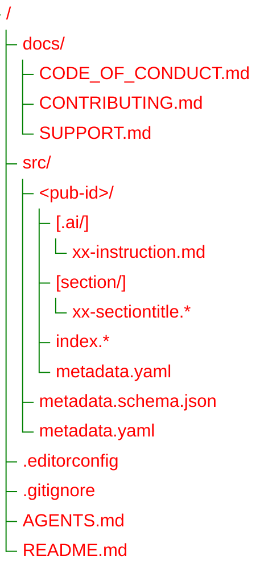

Publications Collection
===

This repository is a working archive for publications.

It stores:
- original authorial publications;
- adaptations of third-party publications, such as translations, annotated versions, or derivative works,
  when the original license permits this.

The repository is not intended to be a generic archive of third-party materials.
Every publication is stored as a separate unit under `src/<pub-id>`.

Repository Structure
---

Repository Structure: Tree View

### Contents Description

**AGENTS.md**
: General guidelines for AI agents and tools.

**.editorconfig**
: Style guides file.

**src/metadata.yaml**
: Shared metadata file. This file is loaded when building any publication from sources.

**src/metadata.schema.json**
: Metadata file schema.

**src/\<pub-id\>**
: A single publication directory. The directory name serves as publication identifier (`pub-id`).

**src/\<pub-id\>/index**
: A publication entry-point (master file).
It may contain the full publication text directly or assemble the publication
from separate section files, such as `section/xx-sectiontitle.*`.
The format of the `index.*` file is defined by its extension.
Refer to [`pandoc documentation`](https://pandoc.org/MANUAL.html#option--from) to see supported formats.

**src/\<pub-id\>/metadata.yaml**
: A publication metadata file. Commonly contains `title`, `subtitle`, and `date` values,
and other publication specific metadata.

Metadata Resolution
---

Publication metadata is resolved from two levels:

1. `src/metadata.yaml`
   Shared metadata used as defaults for all publications.

2. `src/<pub-id>/metadata.yaml`
   Publication-specific metadata.

When the same key exists in both files, the publication-level value from
`src/<pub-id>/metadata.yaml` takes precedence.
