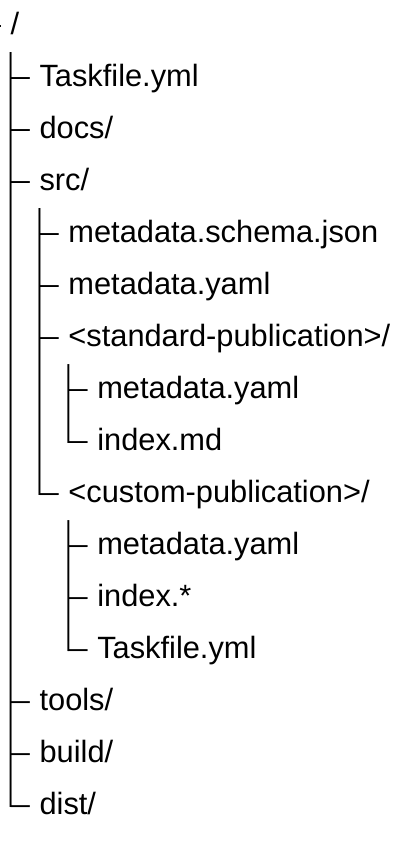

# Build System Specification

Status: Draft\
Audience: contributors, maintainers, automation agents\
Primary automation entrypoint: `task`

## 1. Purpose

This document defines the build-system contract for the repository.

The repository uses `task` as the only supported public automation entrypoint. Contributors, maintainers, CI workflows, and automation agents must use the tasks defined by the repository instead of inventing direct ad-hoc build commands.

The build system must support two build modes:

1. standard repository-level build logic for most publications;
2. publication-specific build overrides for exceptional publications.

## 2. Goals

The build system must provide:

- one stable command interface for local development, CI, and automation agents;
- standard validation and build behavior for regular publications;
- an explicit escape hatch for publications with custom build requirements;
- predictable behavior when commands are run from the repository root or from a publication directory;
- cross-platform command execution suitable for Windows, Linux, and macOS.

## 3. Non-goals

The build system does not attempt to make every publication define its own build logic.

Publication-specific Taskfiles are exceptional overrides, not the default mechanism.

The root Taskfile must remain the normal build entrypoint for the repository.

Complex build logic should not be embedded directly into `Taskfile.yml` when a dedicated script would be clearer and easier to test.

## 4. Terminology

### Root Taskfile

The repository-level `Taskfile.yml` located at the repository root.

The root Taskfile defines the stable public automation API for the whole repository.

### Publication directory

A directory under `src/` that represents one publication.

Example:

```plain
src/<publication-id>/
```

### Standard publication

A publication that does not define its own Taskfile and is built by the root build pipeline.

### Custom publication

A publication that defines its own Taskfile and therefore overrides the standard build pipeline for its own outputs.

### Publication Taskfile

A Taskfile located inside a publication directory.

Supported names are:

```plain
Taskfile.yml
taskfile.yml
Taskfile.yaml
taskfile.yaml
```

The preferred repository convention is:

```plain
src/<publication-id>/Taskfile.yml
```

Bare files named `taskfile` without `.yml` or `.yaml` are not part of the repository convention.

## 5. Core rule

Taskfile discovery is the dispatcher.

The repository relies on Task's native Taskfile discovery behavior instead of implementing a separate manual dispatcher.

When `task` is run from a publication directory:

- if the publication directory contains a supported Taskfile, that local Taskfile is used;
- otherwise, Task walks up the directory tree and falls back to the root Taskfile.

Repository-wide tasks must select the root Taskfile explicitly unless the command is run from the repository root. This avoids accidentally invoking a publication-specific Taskfile when the current directory is a custom publication. Use one of these forms for repository-wide tasks from subdirectories:

```sh
task --dir <repo-root> <task-name>
task --taskfile <repo-root>/Taskfile.yml <task-name>
```

This gives the repository the following behavior:

```plain
src/<publication-id>/Taskfile.yml exists
  -> use publication-specific build logic

src/<publication-id>/Taskfile.yml does not exist
  -> fall back to root Taskfile
  -> use standard build logic
```

## 6. Directory layout

The expected repository layout is:



`build/` and `dist/` are generated-output directories unless documented otherwise.

## 7. Public task contract

The root Taskfile should provide the following public tasks:

```plain
task
task doctor
task list
task validate
task check
task build
task build:all
task build:pub PUB=<publication-id>
task clean
task ci
```

### `task`

Displays available tasks.

### `task doctor`

Checks the local toolchain required by the repository.

This task should verify the availability of required tools such as:

- `task`;
- Python, if repository scripts depend on it;
- Pandoc, if publication builds depend on it;
- any other required build-time executable.

### `task list`

Lists discovered publications.

### `task validate`

Validates repository structure and publication metadata.

This task should not produce build artifacts.

### `task check`

Runs all non-mutating checks.

This task is intended for local verification before committing changes.

### `task build`

Builds publications according to invocation context.

When run from the repository root, it should build all publications.

When run from inside a standard publication directory, it should build that publication using the standard root pipeline.

When run from inside a custom publication directory, the publication Taskfile handles the task.

### `task build:all`

Always builds all publications from the repository root context.

This task must be invoked through the root Taskfile. From outside the repository root, select the root explicitly with `--dir <repo-root>` or `--taskfile <repo-root>/Taskfile.yml`.

This task must not depend on the user's current working directory.

### `task build:pub PUB=<publication-id>`

Builds exactly one publication by ID.

This task must be invoked through the root Taskfile. From outside the repository root, select the root explicitly with `--dir <repo-root>` or `--taskfile <repo-root>/Taskfile.yml`.

This task is useful for CI, scripts, and explicit local builds where relying on the current working directory would be less clear.

### `task clean`

Removes generated build artifacts.

This task must not delete source files.

### `task ci`

Runs the same checks expected by CI.

CI workflows should call `task ci` instead of duplicating build and validation commands directly in workflow files.

## 8. Context-aware root build behavior

The root Taskfile must account for the directory from which the user invoked `task`.

When the root Taskfile is used as a fallback from a subdirectory, Task behaves as if it was run from the directory containing the found Taskfile. Therefore, root tasks that need the original invocation directory must use `{{.USER_WORKING_DIR}}`.

The root `build` task should follow this logic:

```plain
if USER_WORKING_DIR is repository root:
    build all publications

else if USER_WORKING_DIR is inside src/<publication-id>:
    build that publication using the standard pipeline

else:
    fail with a clear error message
```

The root `build:all` task should always build all publications.

The root `build:pub` task should always build the publication identified by `PUB`.

## 9. Publication-specific Taskfile contract

A publication may define its own Taskfile only when the standard root pipeline is not sufficient.

A publication-specific Taskfile must provide at least:

```plain
task build
```

It should provide, when applicable:

```plain
task validate
task check
task clean
```

The publication-specific `build` task is responsible for producing that publication's outputs.

A publication-specific Taskfile must not silently build unrelated publications.

A publication-specific Taskfile must not change repository-wide behavior.

A publication-specific Taskfile should keep its generated outputs inside the repository's documented generated-output locations unless the publication explicitly documents a justified exception.

## 10. Expected command behavior

### Build everything from root

```sh
task build
```

Expected behavior:

```plain
uses ./Taskfile.yml
builds all publications
```

### Build all publications explicitly

From the repository root:

```sh
task build:all
```

From another directory, including a custom publication directory:

```sh
task --dir <repo-root> build:all
```

Expected behavior:

```plain
uses <repo-root>/Taskfile.yml
builds all publications
ignores current publication context
```

### Build one publication explicitly

From the repository root:

```sh
task build:pub PUB=<publication-id>
```

From another directory, including a custom publication directory:

```sh
task --dir <repo-root> build:pub PUB=<publication-id>
```

Expected behavior:

```plain
uses <repo-root>/Taskfile.yml
builds only src/<publication-id>
```

### Build a standard publication by directory context

```sh
cd src/<standard-publication>
task build
```

Expected behavior:

```plain
no local Taskfile is found
Task walks up to repository root
root Taskfile is used
root build task detects USER_WORKING_DIR
only the current publication is built
```

Equivalent explicit form:

```sh
task --dir src/<standard-publication> build
```

### Build a custom publication by directory context

```sh
cd src/<custom-publication>
task build
```

Expected behavior:

```plain
local publication Taskfile is found
publication-specific build task is used
only that publication is built
```

Equivalent explicit form:

```sh
task --dir src/<custom-publication> build
```

## 11. Minimal root Taskfile sketch

This sketch is illustrative. The exact implementation may evolve.

```yaml
version: '3'

output: group

vars:
  SRC_DIR: src
  BUILD_DIR: build
  DIST_DIR: dist
  METADATA_SCHEMA: src/metadata.schema.json

tasks:
  default:
    desc: Show available tasks
    cmds:
      - task --list

  doctor:
    desc: Check required local tools
    cmds:
      - task --version
      - python --version
      - pandoc --version

  list:
    desc: List discovered publications
    cmds:
      - python tools/publications.py list --src {{.SRC_DIR}}

  validate:
    desc: Validate repository structure and metadata
    cmds:
      - python tools/validate.py --src {{.SRC_DIR}} --schema {{.METADATA_SCHEMA}}

  check:
    desc: Run all non-mutating checks
    deps:
      - validate

  build:
    desc: Build publications based on invocation context
    cmds:
      - python tools/build.py --src {{.SRC_DIR}} --out {{.BUILD_DIR}} --user-working-dir "{{.USER_WORKING_DIR}}"

  build:all:
    desc: Build all publications
    cmds:
      - python tools/build.py --src {{.SRC_DIR}} --out {{.BUILD_DIR}} --all

  build:pub:
    desc: Build one publication; usage: task build:pub PUB=<publication-id>
    requires:
      vars:
        - PUB
    cmds:
      - python tools/build.py --src {{.SRC_DIR}} --out {{.BUILD_DIR}} --publication "{{.PUB}}"

  clean:
    desc: Remove generated build artifacts
    cmds:
      - python tools/clean.py --build {{.BUILD_DIR}} --dist {{.DIST_DIR}}

  ci:
    desc: Run CI checks
    deps:
      - check
      - build:all
```

## 12. Minimal publication Taskfile sketch

This sketch is illustrative. Publication-specific Taskfiles should stay small.

```yaml
version: '3'

tasks:
  build:
    desc: Build this publication using custom logic
    cmds:
      - echo "Build custom publication"

  clean:
    desc: Remove generated artifacts for this publication
    cmds:
      - echo "Clean custom publication artifacts"
```

## 13. Agent rules

Automation agents must use the documented Task interface.

Agents must not invent direct build commands such as raw `pandoc`, Python script calls, or shell pipelines when an equivalent `task` command exists.

Agents may propose changes to `Taskfile.yml`, `tools/`, or this specification when the current task contract is insufficient.

Agents must treat publication-specific Taskfiles as explicit build overrides.

Agents must not add publication-specific Taskfiles unless there is a concrete reason why the standard root pipeline is insufficient.

## 14. Design summary

The build-system model is:

```plain
task discovery = dispatcher
root Taskfile = default repository API
publication Taskfile = explicit override
USER_WORKING_DIR = context for root fallback behavior
```

This allows the repository to support both regular and exceptional publications without requiring every publication to duplicate build automation.
